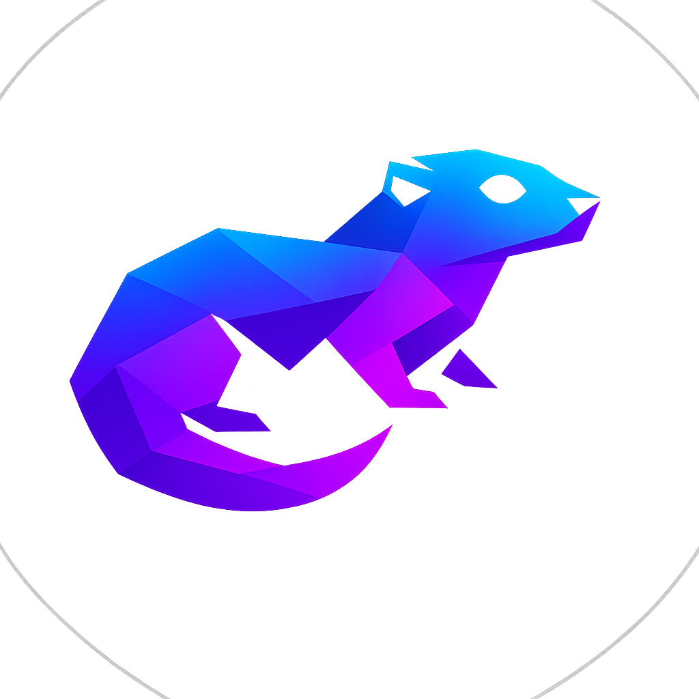

  
  <h1>Leyo Shell</h1>
  
Un shell moderne pour Windows — syntaxe Unix, interface élégante

  
  
  
  

---

## 🗺️ Cheminement — SHELDON v1.X

> SHELDON est le nom de code de la branche 1.X de Leyo.
> Chaque version a apporté une brique fondamentale au projet,
> du simple parser en ligne de commande à la vraie app desktop que tu utilises aujourd'hui.

---

### v0.1.0 
*Comprendre et exécuter des commandes.*

On pose les fondations. Un parser traduit les commandes Unix vers leurs équivalents Windows (`ls` → `dir`, `rm` → `del`, `mkdir` → `mkdir`...). Un executor les envoie à `cmd.exe` et récupère le résultat. À ce stade, Leyo est un programme en ligne de commande basique mais fonctionnel.

---

### v0.2.0 
*Leyo se souvient de ce que tu as tapé.*

Ajout d'un système d'historique persistant. Les commandes sont sauvegardées dans `%APPDATA%\leyo_history.txt` entre les sessions. La commande `history` affiche les entrées précédentes. La navigation avec `↑` `↓` sera connectée à l'étape suivante.

---

### v0.3.0
*Leyo devient un vrai shell coloré.*

Intégration de **Bubbletea**, un framework TUI en Go. Le terminal gagne une palette de couleurs (cyan, violet, magenta), un prompt stylé `[VinX] chemin >`, la navigation historique avec les flèches, et une animation sobre au démarrage. C'est la première fois que Leyo ressemble à quelque chose.

---

### v0.4.0
*L'interface se divise en deux zones distinctes.*

Ajout du **Dual-pane** : une sidebar à gauche liste en temps réel les fichiers et dossiers du répertoire courant, avec des couleurs différentes selon le type de fichier (`.go`, `.exe`, `.md`, `.json`...). La zone de droite reste le terminal. La sidebar se rafraîchit automatiquement après chaque commande.

---

### v1.0.0 *(milestone majeur)*
*Leyo devient une vraie application desktop.*

Migration complète vers **Wails** — Leyo n'est plus un programme qui tourne dans `cmd.exe` mais une fenêtre native Windows avec une interface HTML/CSS/JS sur un cœur Go. Le design est entièrement repensé autour du logo low-poly : fond sombre profond, dégradés géométriques, bande de couleur en haut, sidebar avec liseré dégradé. Le logo officiel est intégré dans le header.

---

### v1.1.0
*Leyo comprend quand tu fais une faute de frappe.*

Implémentation de l'algorithme de **distance de Levenshtein**. Quand une commande est inconnue, Leyo calcule la commande la plus proche dans une liste de commandes connues et dans ton historique personnel. Une suggestion violette apparaît avec deux boutons — **Exécuter** ou **Ignorer**.

mkdor test
❌ 'mkdor' n'est pas reconnu...
💡 Vouliez-vous dire : mkdir  [Exécuter] [Ignorer]
---

### v1.2.0 
*Leyo finit tes phrases.*

Ajout du **Ghost text** : en tapant les premières lettres d'une commande, Leyo affiche en grisé la complétion la plus probable issue de ton historique et des commandes connues. La touche `→` ou `Tab` accepte la suggestion instantanément.
mkd█ir   ← "ir" apparaît en grisé

---

### v1.3.0 
*Leyo fais peau neuve*

Refonte visuelle complète alignée sur le logo officiel — animal low-poly aux couleurs cyan → bleu → violet → magenta. Nouveaux éléments UI : polygones décoratifs en CSS, bandes dégradées, indicateur de hover dans la sidebar, zone de prompt encadrée avec liseré coloré. Correction de la fenêtre `cmd.exe` noire qui s'ouvrait brièvement à chaque commande (`HideWindow: true`).

---

### v1.3.1
*Les chemins fonctionnent vraiment.*

Refonte complète de la gestion du `cd`. Avant cette version, `cd ..` et les chemins relatifs comme `cd ../dossier` pouvaient planter. Désormais `filepath.Clean` résout tous les cas : chemins relatifs, absolus, remontées multiples, guillemets, espaces dans les noms.

---

### v1.3.2 
*Leyo s'ouvre depuis n'importe où.*

Correction du bug WebView2 qui empêchait Leyo de démarrer si lancé depuis un dossier sans droits d'écriture (comme `Downloads`). Le dossier de données WebView2 est désormais fixé dans `%APPDATA%\Leyo`, un emplacement toujours accessible.

---

### v1.4.0 *(version actuelle)*
*Leyo devient un vrai outil de productivité.*

Trois ajouts majeurs en une version :

**Onglets** — ouvre plusieurs sessions simultanées avec `Ctrl+T`, ferme avec `Ctrl+W`. Chaque onglet conserve son propre historique d'output et son chemin courant.

**Alias** — crée tes propres raccourcis persistants entre les sessions :
alias ll="ls -la"    → crée l'alias
alias               → liste tous les alias
unalias ll          → supprime l'alias

**Installeur** — `LeyoSetup.exe` installe Leyo proprement sur Windows avec raccourci Bureau, entrée dans le Menu Démarrer et désinstalleur intégré dans les paramètres Windows.

---

## ✨ Fonctionnalités actuelles

- **Syntaxe Unix** — `ls`, `rm`, `mkdir`, `cp`, `mv`, `cat`, `touch`, `pwd`
- **Dual-pane** — sidebar fichiers interactive mise à jour en temps réel
- **Correction intelligente** — suggestions sur faute de frappe (Levenshtein)
- **Ghost text** — autocomplétion en texte grisé
- **Historique** — persistant entre les sessions, navigation `↑` `↓`
- **Onglets** — plusieurs sessions avec `Ctrl+T` / `Ctrl+W`
- **Alias** — raccourcis personnalisés persistants
- **Interface native** — vraie fenêtre Windows, fond noir profond, palette low-poly

---

## 🎮 Commandes

### Navigation
| Commande | Description |
|---|---|
| `ls` | Liste les fichiers |
| `cd dossier` | Change de dossier |
| `cd ..` | Remonte d'un niveau |
| `pwd` | Chemin courant |
| `mkdir nom` | Crée un dossier |

### Fichiers
| Commande | Description |
|---|---|
| `cp source dest` | Copie |
| `mv source dest` | Déplace |
| `rm fichier` | Supprime |
| `cat fichier` | Affiche le contenu |
| `touch fichier` | Crée un fichier vide |

### Leyo
| Commande | Description |
|---|---|
| `history` | Historique des commandes |
| `alias` | Liste les alias |
| `alias nom="cmd"` | Crée un alias |
| `unalias nom` | Supprime un alias |
| `clear` | Vide l'écran |
| `exit` | Ferme Leyo |

### Raccourcis clavier
| Raccourci | Action |
|---|---|
| `↑` / `↓` | Historique |
| `→` ou `Tab` | Accepter ghost text |
| `Ctrl+T` | Nouvel onglet |
| `Ctrl+W` | Fermer l'onglet |
| `Ctrl+C` | Copier la sélection |
| `Ctrl+V` | Coller |
| `Ctrl+A` | Sélectionner tout |

---

## 📥 Installation

### Option 1 — Installeur (recommandé)
1. Télécharge `LeyoSetup.exe` depuis [Releases](../../releases)
2. Lance l'installeur
3. Leyo apparaît sur le Bureau et dans le Menu Démarrer

### Option 2 — Portable
1. Télécharge `Leyo.exe` depuis [Releases](../../releases)
2. Place le dans `C:\Leyo\`
3. Lance `Leyo.exe`

> ⚠️ Windows peut afficher un avertissement car Leyo n'est pas signé numériquement. Clique sur **"Informations complémentaires" → "Exécuter quand même"**.

---
